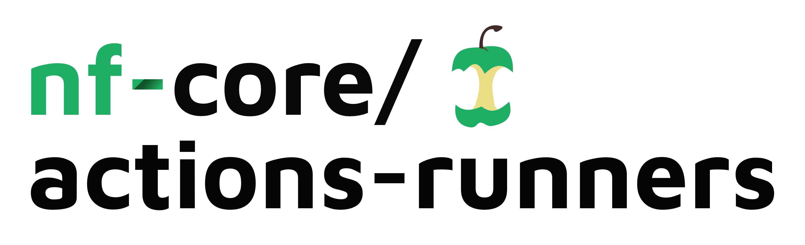

<picture>
  <source media="(prefers-color-scheme: dark)" srcset="images/nfcore-actionsrunners_logo_dark.png">
  
</picture>

# Introduction

nf-core uses GitHub Actions to run continuous integration (CI) tests for every change on every repository.
As we get bigger, the number of those tests increases and can start to overwhelm our free allowance at GitHub (20 concurrent jobs).
This gets very annoying, as people need to wait quite a long time for jobs to run on their pull requests before they can be merged.
The problem is particularly acute during events such as hackathons.

To get around this, we can create custom [self-hosteed GitHub Actions runners](https://docs.github.com/en/actions/hosting-your-own-runners/about-self-hosted-runners) to provide more compute power for the CI jobs.
We do this on the nf-core AWS account, which is kindly funded by credits provided by AWS for our project.

Runners are created at the organisation level and share the same tags as the default GitHub runners. This means that all jobs may run on them, and they simply help to drain the job queue. They are automatically scaled up and down based using [Philips-labs/terraform-aws-github-runner](https://github.com/philips-labs/terraform-aws-github-runner/).

# Requirements

- Terraform
- AWS account with permissions to create EC2 instances and IAM roles

# Instructions

1. Setup a org level GitHub app as described in [Philips-labs/terraform-aws-github-runner](https://github.com/philips-labs/terraform-aws-github-runner/tree/main?tab=readme-ov-file#setup-github-app-part-1).

2. Create a `terraform.tfvars` file with the following variables:

```hcl
github_app = {
    id = YOUR_ID
    key_base64 = BASE64_CONVERTED_KEY
}

```

> [!NOTE]
> On MacOS you can create the base64 converted key with `cat YOUR_PEM_KEY_FILE | base64 -w0 `

3. Download lambda function dependencies with:

```bash
cd lambdas-download
terraform init
terraform apply
cd ..
```

4. Run `terraform init` to initialize the terraform modules.

5. Run `terraform apply` to set everything up.

# Troubleshooting

- Runners are not starting:
 - Check that the `runs-on:` value in the github action matches one of the values in `labelMatchers` in the `linux-x64-ubuntu.yaml`
 - Check in the settings of the Github App that they are installed and have the permission to run in the corresponding repository (click on the gear icon next to the installed app)

- Stop using the self-hosted runners
  - Terminate all instances named `multi-runner*` on AWS
  - Remove all runners in the list of runners in the github settings.
  - deactivate the webhook in the Github settings for the app.

- `touch: .command.trace: Permission denied` error:
    When running tests with Docker in self-hosted runners the user needs to be fixed. Add the following to the docker profile:
    ```
    docker.fixOwnership = true
    ```
  - nf-core/tools test:
    - Check the config file in the `nf-test-tests` branch from GitLab: `modules-test/tests/config/nf-test.config`
  - nf-core/modules tests:
    - `tests/config/nextflow.config`
    - `modules/tests/config/nf-test.config`
